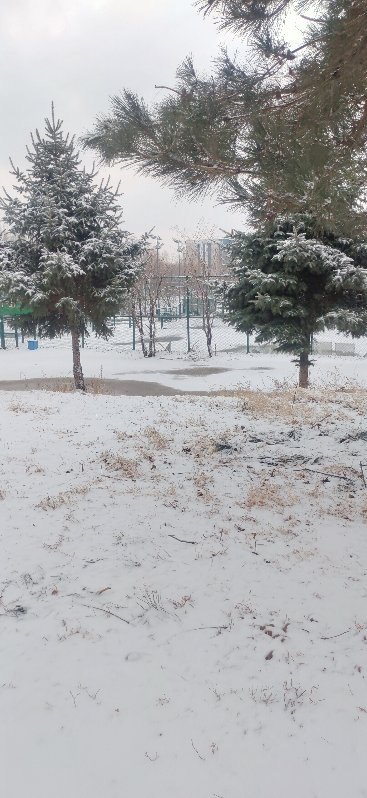

## an h2 header
#### an h4 header
[back to README.md](./README.md)
## a link to a next ernal web site
[link to bilibili](https://www.bilibili.com/v/cinephile/?spm_id_from=333.851.b_7072696d6172794368616e6e656c4d656e75.69)

## 1.next markdown file XC1.md url
[next markdown file](./xc1.md)

## 2.show images
#### 1.image from resource

#### 2.image from web

## 3.a  highlighted code block
~~~C
#include<stdio.h>
int main(){
int a,b,c;
a=10;
b=2*a;
c=a+b;
printf("c EQUALS：");
printf("%d",c);}
~~~

## 4. a block quote.
>God helps those who help themselves.

## 5.a bulleted list.
- first
- second
- third

## 6. a numbered list.
1. row1
2. row2
3. row3

## 7.a table 
|subjects|grades|
|--------|------|
|Chinese |89    |
|math    | 100  |
|English | 95   |

## 8.bolded text.
**those words are boldface**
## 9.italicized text.
*we are italics*
## 10.strikethrough text ~~like this~~
~~those words are deleted ,over ,ok.~~
## 10.a horizontal rule like the one that follows this list.
---
---
